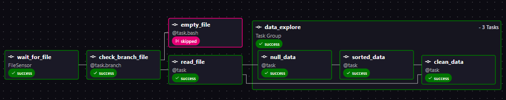
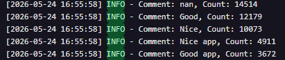
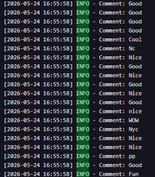
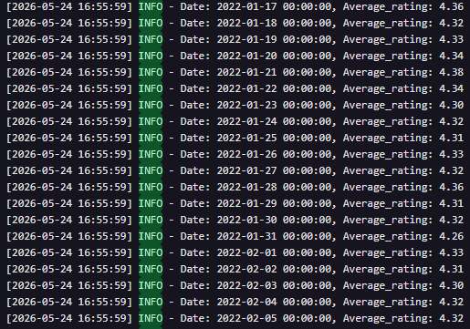

# Airflow ETL Pipeline with MongoDB

## Project Description

This project demonstrates a complete ETL pipeline built with Apache Airflow, Astro, Pandas, and MongoDB.

The pipeline processes a CSV dataset containing TikTok reviews.
The workflow automatically detects the dataset, validates the file, performs several transformation tasks, and loads the processed data into MongoDB using Dataset Data-aware scheduling.

The project was developed locally using Docker and Astro CLI.

## Technologies Used

- Apache Airflow
- Astro CLI
- Python
- Pandas
- MongoDB
- Docker

## Pipeline Architecture

CSV Dataset
↓
FileSensor
↓
Branch Task (empty / not empty)
↓
TaskGroup Transformations --> (Replace null values, Sort by date, Clean text data)
↓
Dataset Asset Created
↓
Second DAG Triggered using Assets
↓
Load Processed Data into MongoDB

## DAG Functionality

### Extract & Transform DAG

The wait_for_dataset DAG performs the following operations:

1. Waits for the dataset file using FileSensor
2. Checks whether the file is empty using task.branch
3. Executes data transformation tasks inside a TaskGroup:
   - Replace null values with "-"
   - Sort data by creation date
   - Clean the content column using regex

The final cleaned dataset is published as an Airflow Asset.

### Load DAG

The loading_data DAG uses Dataset Data-aware scheduling and is automatically triggered after the final dataset is updated.

This DAG:

- Reads the processed CSV file
- Converts the data into dictionary records
- Loads all records into MongoDB using MongoHook

## Pictures

1.  

2.  

3.

QUERY 1: Top 5 frequently occurring comments

4.

QUERY 2: All entries where the “content” field is less than 5 characters long

5.

QUERY 3: Average rating for each day (the result should be in timestamp type)

